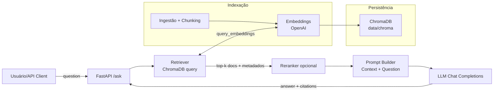

## RAG PoC Corporativo (Replicável) — FastAPI + ChromaDB + OpenAI

PoC de Retrieval-Augmented Generation (RAG) baseada em um projeto real aplicado em cliente e disponibilizada em formato simples para reprodução rápida. O objetivo é reduzir o tempo entre ideia e demonstração, oferecer um baseline técnico claro e facilitar a evolução colaborativa.

# O que é RAG (em termos práticos)

RAG combina um LLM com uma camada de recuperação de contexto sobre documentos internos. Em vez de “alucinar”, o modelo responde com base em trechos relevantes recuperados de um índice vetorial e cita as fontes. O fluxo é: ingestão → chunking → embeddings → indexação → recuperação top-k → re-ranking (opcional) → geração condicionada ao contexto com citações.

# Principais funcionalidades

Ingestão e chunking: leitura de PDFs/MD/TXT, chunks ~400 tokens, metadados enriquecidos (title, doc_id, section e, quando disponível, page e source).

Indexação: embeddings com OpenAI (text-embedding-3-large/small) e persistência local no ChromaDB.

Recuperação: consulta vetorial top-k diretamente na coleção persistida.

Geração com contexto: endpoint /ask monta prompt com os trechos recuperados e chama o LLM (gpt-4o-mini por padrão), retornando citações inline e lista de fontes com snippets.

Replicabilidade: dependências mínimas, código direto ao ponto, ideal para estudo e evolução.

# Arquitetura (Visão Geral)

**Stack**

Linguagem/Runtime: Python 3.11, FastAPI, Uvicorn.

Vetor store: ChromaDB (persistência local em data/chroma).

Embeddings: OpenAI (text-embedding-3-large/small) — com opção futura de SentenceTransformers local.

LLM: OpenAI Chat (gpt-4o-mini padrão, ajustável via .env).

# Quickstart

**1) Setup**

python -m venv .venv

Windows

.venv\\Scripts\\activate

pip install -r requirements.txt

**2) Configuração (.env)**

Crie um arquivo .env na raiz com, por exemplo:

OPENAI_API_KEY=sk-...

EMBEDDING_MODEL=text-embedding-3-small

CHAT_MODEL=gpt-4o-mini

CHROMA_PATH=data/chroma

CHROMA_COLLECTION=docs

**3) Dados de exemplo**

Coloque 1–2 arquivos em data/raw (PDF/MD/TXT). Se preferir manter o repositório limpo, use data/examples para compartilhar exemplos e ignore data/raw no Git.

**4) Construir o índice**
 
python -m src.index.build_index

Saída esperada: Indexed N chunks

**5) Subir a API**
 
uvicorn src.api.main:app --reload --port 8000

Acesse Swagger: http://127.0.0.1:8000/docs

**6) Testar**

No Swagger, chame POST /ask com:

{
  "question": "sua questão"
}

Resposta esperada: texto ancorado em trechos dos documentos, com citações inline do tipo [Arquivo.pdf#pX-cY] e sources contendo metadados e snippet.

# Estrutura do Projeto

rag-genai-poc/

├─ src/

│  ├─ api/

│  │  └─ main.py            # FastAPI (/ask), retriever simples, prompt builder, formatação de fontes

│  ├─ generator/

│  │  └─ llm.py             # Wrapper de chat para OpenAI (ou Azure OpenAI)

│  ├─ index/

│  │  └─ build_index.py     # Ingestão, chunking, embeddings e upsert no Chroma

│  └─ ...

├─ data/

│  ├─ raw/                  # Documentos de entrada (não versionados por padrão)

│  ├─ processed/            # Opcional para limpeza/conversões

│  └─ chroma/               # Persistência local do vetor store

├─ .env                     # Configs (não versionado)

├─ requirements.txt

├─ README.md

└─ .gitignore

# Detalhes técnicos relevantes

**Ingestão e indexação**

chunk_document(...) divide por ~400 tokens (ajustável) e preenche metadados úteis: title, doc_id, section, e quando disponível page e source.

build_index.py gera embeddings com OpenAIEmbeddings e faz upsert no Chroma com ids, documents, metadatas e embeddings.

**Recuperação e geração**

O retriever consulta a coleção com query_embeddings (embedding da pergunta) e retorna top-k por distância.

O reranker atual é um no-op (ordena por distância). É trivial trocar por um cross-encoder (ex.: ms-marco-MiniLM-L-6-v2).

O prompt builder agrega os snippets mais relevantes e instrui o LLM a responder somente com base no contexto e citar fontes.

**Exemplo de Request/Response**

Request:

POST /ask
Content-Type: application/json
{
  "question": "Quais são os principais pontos do documento X?"
}

Response (exemplo abreviado):

{
  "answer": "... [Lei_9099.pdf#p1-c0]",
  "sources": [
    {
      "title": "Lei_9099.pdf",
      "page": 1,
      "section": 0,
      "source": "data/raw/Lei_9099.pdf",
      "doc_id": "44f0d31e...",
      "snippet": "Art. 1º ..."
    }
  ]
}

# Roadmap (aberto a contribuições)

Re-ranking com cross-encoder local (SentenceTransformers) para melhorar precisão.

Filtros por metadados (por título, recência, tipo de documento) e boosting.

UI em Streamlit (pergunta, resposta, fontes, scores, tempos por etapa).

Observabilidade: métricas de latência/custo, logging de Q/A em .jsonl.

Avaliação: conjunto de Q/A, EM/F1 e groundedness/faithfulness.

Dockerfile/Compose para subir com um comando.

Troubleshooting rápido

429 insufficient_quota: verifique créditos/planos no provedor de LLM/embeddings; use batching e modelos menores (text-embedding-3-small).

Embeddings vazios: garanta arquivos em data/raw, filtre chunks vazios e valide len(texts) > 0 e len(vectors) > 0.

Formato de mensagens inválido: a API de chat espera messages=[{role, content}, ...]; não envie string pura.

Chroma include: use somente itens válidos em include=["documents","metadatas","distances"].

# Licença e uso interno

PoC criada para uso interno/educacional e rápida validação. Adapte livremente para seus casos.

Contribua enviando PRs e abrindo issues com ideias de melhoria. Se quiser discutir aplicações específicas, me chame!
